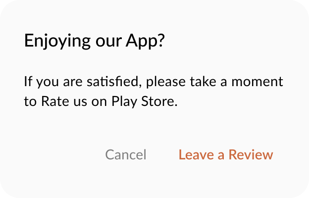

<p align="center">
  <a href="https://central.sonatype.com/artifact/com.stevdza-san/app-rating"></a>
</p>

# <p align="center">⭐ AppRating-KMP </p>

<p align="center">
A <b>Kotlin Multiplatform</b> library, used to display a customizable App Rating dialog, prompting users to leave a review on the Play Store (Android) or App Store (iOS). The library supports configurable intervals for showing the dialog, ensuring a non-intrusive yet effective way to gather app reviews.
</p><br>

<p align="center">

  &nbsp;

</p>

## Features

- Kotlin Multiplatform Support: Works seamlessly on both `Android` and `iOS`.
- Customizable Intervals: Show the app rating dialog monthly, quarterly, semi-annually, or yearly.
- Initial Delay: Configure an initial delay period `(minimum 5 days)` before showing the dialog.
- User Acknowledgement: If the user cancels the dialog, it will `reset` the interval. If the user clicks a button to leave a review, the dialog will `not` show again.
- Customizable UI: Fully customizable text, colors, and styles for the dialog.
- Lightweight and Easy to Integrate: Minimal setup and configuration required.

## Installation
Add the library dependency to your `commonMain` source set:

```gradle
implementation("com.stevdza-san:app-rating:1.0.0")
```

## Usage
Integrate the `AppRatingDialog` at the top level of your UI hierarchy, such as alongside your `NavHost` in a Jetpack Compose application.

### Basic
```kotlin
@Composable
fun MainScreen() {

    AppRatingDialog(
        playStoreLink = "https://play.google.com/store/apps/details?id=PACKAGE_NAME",
        appStoreLink = "https://apps.apple.com/app/YOUR_APP/ID",
        interval = Interval.Monthly
    )

    ..
}
```

### Customization
```kotlin
AppRatingDialog(
    playStoreLink = "https://play.google.com/store/apps/details?id=PACKAGE_NAME",
    appStoreLink = "https://apps.apple.com/app/YOUR_APP/ID",
    initialDelayInDays = 7, // The initial period when the first dialog should show
    interval = Interval.Quarterly, // Interval for showing the dialog
    title = { Text(text = "Enjoying our App?") },
    content = { Text(text = "If you're happy with the app, please leave us a review!") },
    dismissText = "No thanks",
    confirmText = "Rate now",
    onDismiss = { /* Handle dismiss action */ }
)
```

### Intervals
The library supports the following intervals for showing the dialog after the initial delay:

- Interval.Monthly
- Interval.Quarterly
- Interval.SemiAnnually
- Interval.Yearly

The dialog will only show after the specified interval has passed since the last interaction.

### Initial delay
You can specify an initial delay (in days) before the dialog is shown for the first time. The default and minimum value is 5 days, but you can set it to any value greater than or equal to 5.

### Reset
If the user clicks a Negative button, the dialog's timestamp is reset, and the dialog will appear again at the next interval. If the user clicks a Positive button on the other hand, the operation should be considered as complete, and the dialog will not show again.


## Like what you see? :yellow_heart:
⭐ Give a star to this repository. <br />
☕ Let's get a coffee. You're paying!😜 https://ko-fi.com/stevdza_san

# License
```xml
Designed and developed by stevdza-san (Stefan Jovanović)

Licensed under the Apache License, Version 2.0 (the "License");
you may not use this file except in compliance with the License.
You may obtain a copy of the License at

   http://www.apache.org/licenses/LICENSE-2.0

Unless required by applicable law or agreed to in writing, software
distributed under the License is distributed on an "AS IS" BASIS,
WITHOUT WARRANTIES OR CONDITIONS OF ANY KIND, either express or implied.
See the License for the specific language governing permissions and
limitations under the License.
```
